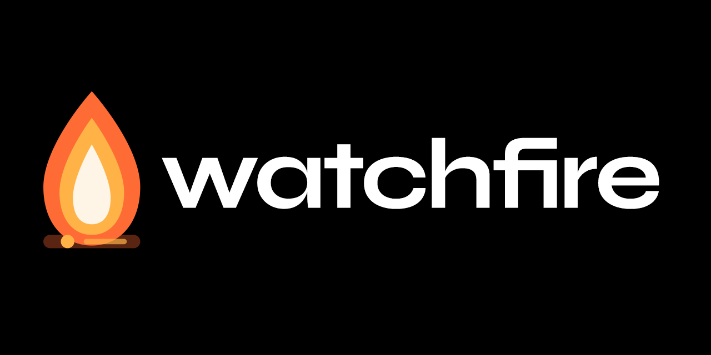
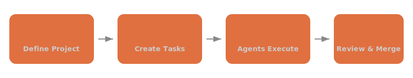
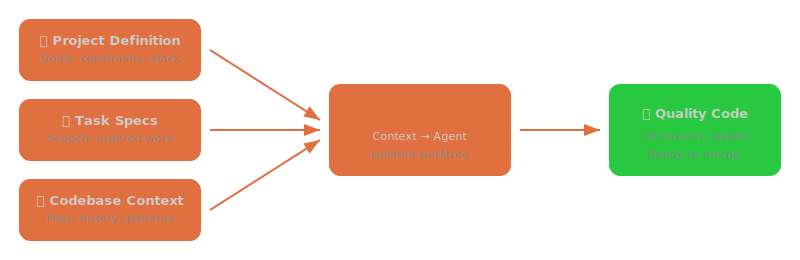

<p align="center">
  
</p>

<h3 align="center"><strong>Better context. Better code.</strong></h3>

<p align="center">
AI coding agents work best when they have the right context. Watchfire lets you define your project structure, break work into well-scoped tasks, and orchestrate agents that execute with full awareness of your codebase, constraints, and goals. It manages context automatically — so agents stay on track and produce code you'd actually ship.
</p>

---

## Install

### Download (macOS)

<p align="center">
  <a href="https://github.com/watchfire-io/watchfire/releases/latest">
    
  </a>
</p>

### Homebrew

**Desktop app** (GUI + CLI):

```bash
brew tap watchfire-io/tap
brew install --cask watchfire-io/tap/watchfire
```

**CLI & daemon only**:

```bash
brew tap watchfire-io/tap
brew install watchfire-io/tap/watchfire
```

---

## How It Works

<p align="center">
  
</p>

---

## Key Features

### 🎯 Context Management

Define your project once. Watchfire feeds agents the right specs, constraints, and codebase context — no copy-pasting prompts.

### 📋 Structured Workflow

Break big projects into tasks with clear specs. Agents tackle them in order, each in an isolated git worktree branch.

### 🚀 Scale with Confidence

Run agents across multiple projects in parallel. Monitor live terminal output, review results, and merge — from TUI or GUI.

<p align="center">
  
</p>

---

## Agent Modes

| Mode | Description |
|------|-------------|
| **Chat** | Interactive session with the coding agent |
| **Task** | Execute a specific task from the task list |
| **Start All** | Run all ready tasks sequentially |
| **Wildfire** | Autonomous loop: execute tasks, refine drafts, generate new tasks |
| **Generate Definition** | Auto-generate a project definition from your codebase |
| **Generate Tasks** | Auto-generate tasks from the project definition |

---

## Build from Source

```bash
# Build & install
make install-tools   # Dev tools (golangci-lint, air, protoc plugins)
make build           # Build daemon + CLI
make install         # Install to /usr/local/bin

# Use it
cd your-project
watchfire init       # Initialize a project
watchfire task add   # Add tasks
watchfire            # Launch the TUI
```

---

## Components

| Component | Binary | Description |
|-----------|--------|-------------|
| **Daemon** | `watchfired` | Orchestration, PTY management, git workflows, gRPC server, system tray |
| **CLI/TUI** | `watchfire` | Project-scoped CLI commands + interactive TUI mode |
| **GUI** | `Watchfire.app` | Electron multi-project client |

## Development

```bash
make dev-daemon   # Daemon with hot reload
make dev-tui      # Build and run TUI
make dev-gui      # Electron GUI dev mode
make test         # Tests with race detector
make lint         # Linting
make proto        # Regenerate protobuf code
```

## Architecture

See [ARCHITECTURE.md](ARCHITECTURE.md) for the full design document.

## License

Proprietary. All rights reserved.
