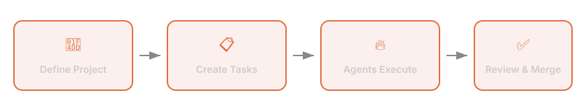
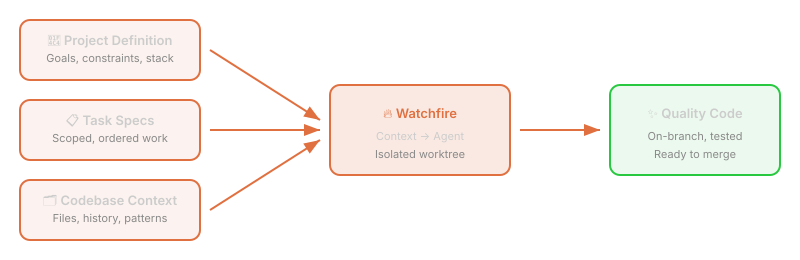

<p align="center">
  
</p>

<h3 align="center"><strong>Better context. Better code.</strong></h3>

<p align="center">
AI coding agents work best when they have the right context. Watchfire lets you define your project structure, break work into well-scoped tasks, and orchestrate agents that execute with full awareness of your codebase, constraints, and goals. It manages context automatically — so agents stay on track and produce code you'd actually ship.
</p>

---

## Install

### macOS

<p align="center">
  <a href="https://github.com/watchfire-io/watchfire/releases/latest">
    
  </a>
</p>

**Homebrew** (recommended):

```bash
brew tap watchfire-io/tap
brew install --cask watchfire-io/tap/watchfire   # Desktop app (GUI + CLI)
brew install watchfire-io/tap/watchfire          # CLI & daemon only
```

**Script:**

```bash
curl -fsSL https://raw.githubusercontent.com/watchfire-io/watchfire/main/scripts/install.sh | bash
```

### Linux

```bash
curl -fsSL https://raw.githubusercontent.com/watchfire-io/watchfire/main/scripts/install.sh | bash
```

Homebrew also works on Linux:
```bash
brew tap watchfire-io/tap && brew install watchfire-io/tap/watchfire
```

### Windows

```powershell
irm https://raw.githubusercontent.com/watchfire-io/watchfire/main/scripts/install.ps1 | iex
```

---

## How It Works

<p align="center">
  
</p>

---

## Key Features

### 🎯 Context Management

Define your project once. Watchfire feeds agents the right specs, constraints, and codebase context — no copy-pasting prompts.

### 📋 Structured Workflow

Break big projects into tasks with clear specs. Agents tackle them in order, each in an isolated git worktree branch.

### 🚀 Scale with Confidence

Run agents across multiple projects in parallel. Monitor live terminal output, review results, and merge — from TUI or GUI.

<p align="center">
  
</p>

---

## Agent Modes

| Mode | Description |
|------|-------------|
| **Chat** | Interactive session with the coding agent |
| **Task** | Execute a specific task from the task list |
| **Start All** | Run all ready tasks sequentially |
| **Wildfire** | Autonomous loop: execute tasks, refine drafts, generate new tasks |
| **Generate Definition** | Auto-generate a project definition from your codebase |
| **Generate Tasks** | Auto-generate tasks from the project definition |

---

## MCP Server

Watchfire is also an **MCP server**: any MCP-capable coding agent can use it
as a *factory for other agents*. The outer agent plans and reviews;
Watchfire manufactures the code in sandboxed, git-worktree-isolated runs
and merges the results.

The server is **local-only by construction** — its only transport is stdio,
spawned by the MCP client on this machine. It never opens a TCP socket and
is not reachable from outside the host.

### Quickstart

Register the server with your client in one command:

```bash
watchfire mcp install claude-code   # Claude Code
watchfire mcp install codex         # OpenAI Codex  (~/.codex/config.toml)
watchfire mcp install gemini        # Gemini CLI    (~/.gemini/settings.json)
watchfire mcp install opencode      # opencode      (~/.config/opencode/opencode.json)
watchfire mcp install copilot       # Copilot CLI   (~/.copilot/mcp-config.json)

watchfire mcp install               # interactive picker (the five above + Custom)
```

Installers merge into existing config files (never overwrite) and are
idempotent — re-running updates or no-ops. If a client isn't installed or
its config can't be parsed, the manual snippet is printed instead.

For any other MCP client, print the generic snippet:

```bash
watchfire mcp install --print
```

```json
{
  "command": "watchfire",
  "args": ["mcp", "serve"]
}
```

### The factory loop

The server exposes Watchfire's project, task, run, and inspect surfaces as
MCP tools. The canonical loop for an outer agent:

1. `create_task` — file a task (status `ready`) with a prompt + acceptance criteria
2. `run_task` — launch a sandboxed agent on it in an isolated worktree
3. `wait_for_task` — block until the run completes
4. `get_task` — check `success` / `failure_reason`
5. `get_task_diff` — review exactly what changed, then iterate with follow-up tasks

### Read-only mode

`watchfire mcp serve --read-only` serves only observation tools (projects,
diffs, screens, insights, logs, agent status) — no task creation or agent
control. Useful for dashboards or less-trusted callers.

### A note on recursion

A Watchfire-managed agent could itself call the Watchfire MCP server —
tasks spawning tasks. This works, but it is not the designed pattern
(outer agent → Watchfire is), and an agent that files new tasks on every
run can create an unbounded task-spawning loop. Prefer having the outer
agent own the loop and review each run's diff before queueing more work.

---

## Build from Source

```bash
# Build & install
make install-tools   # Dev tools (golangci-lint, air, protoc plugins)
make build           # Build daemon + CLI
make install         # Install to /usr/local/bin

# Use it
cd your-project
watchfire init       # Initialize a project
watchfire task add   # Add tasks
watchfire            # Launch the TUI
```

---

## Components

| Component | Binary | Description |
|-----------|--------|-------------|
| **Daemon** | `watchfired` | Orchestration, PTY management, git workflows, gRPC server, system tray |
| **CLI/TUI** | `watchfire` | Project-scoped CLI commands + interactive TUI mode |
| **GUI** | `Watchfire.app` | Electron multi-project client |

## Development

```bash
make dev-daemon   # Daemon with hot reload
make dev-tui      # Build and run TUI
make dev-gui      # Electron GUI dev mode
make test         # Tests with race detector
make lint         # Linting
make proto        # Regenerate protobuf code
```

## Architecture

See [ARCHITECTURE.md](ARCHITECTURE.md) for the full design document.

## Star History

<a href="https://www.star-history.com/?repos=watchfire-io%2Fwatchfire&type=timeline&legend=bottom-right">
 <picture>
   <source media="(prefers-color-scheme: dark)" srcset="https://api.star-history.com/chart?repos=watchfire-io/watchfire&type=timeline&theme=dark&legend=top-left" />
   <source media="(prefers-color-scheme: light)" srcset="https://api.star-history.com/chart?repos=watchfire-io/watchfire&type=timeline&legend=top-left" />
   
 </picture>
</a>

## License

Licensed under the [Apache License, Version 2.0](LICENSE).
